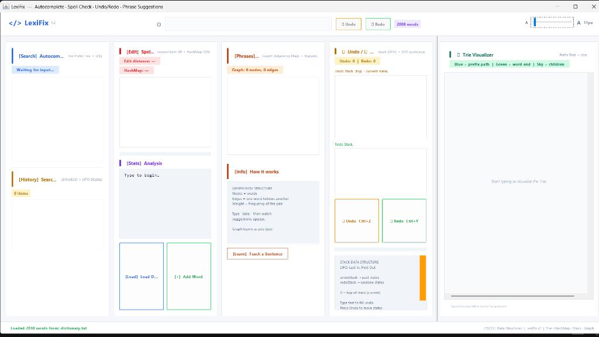
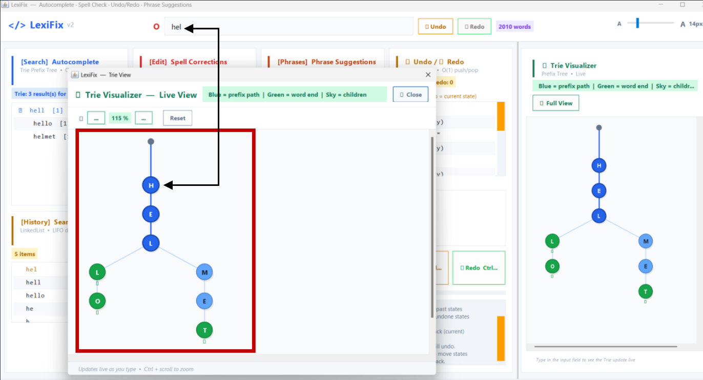
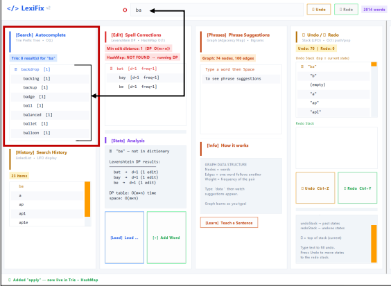
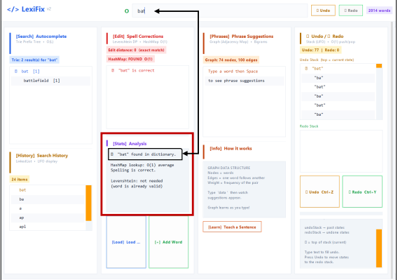
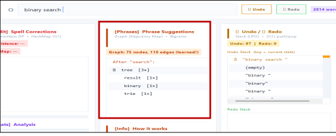

# 🚀 LexiFix

> A Premium, DSA-Powered Interactive Text Assistant, Autocomplete Engine, and Spell Checker built with Java Swing.

LexiFix is a modern desktop application that showcases the power of fundamental Data Structures and Algorithms (DSA) in text processing. Designed with a clean, responsive light-themed GUI, it functions as a real-time typing companion, offering instant autocomplete, dynamic spelling corrections, phrase predictions, and visual tree tracing.

---

## 📸 Graphical User Interface (GUI) Showcase

Below are the screenshots of the LexiFix interface. 

> [!TIP]
> To display your own screenshots, save your images in the `assets/` folder with the names specified below:

| Feature / Screen | GUI Screenshot | Description |
| :--- | :--- | :--- |
| **Main Application Workspace** |  | The central hub containing the interactive editor, real-time typing status, statistics, and modular DSA dashboards. |
| **Live Trie Visualizer Canvas** |  | An interactive prefix tree rendering. Shows active paths, end-of-word markers, and lets you zoom & pan to inspect how strings are stored. |
| **Autocomplete & Search History** |  | Auto-suggests words based on prefix matching and tracks search history in a LIFO manner. |
| **Spell Correction & Analytics** |  | Displays spelling suggestion candidates calculated via edit-distance alongside performance metrics. |
| **Phrase Suggestions Graph** |  | Directed graph representing bigram relationships. Visualizes word transitions and learns new patterns on the fly. |

---

## 🧠 Core Features & DSA Underpinnings

LexiFix integrates multiple classical data structures to deliver highly optimized text processing at scale:

### 🔍 1. Autocomplete Engine (Trie)
* **Data Structure:** Trie (Prefix Tree).
* **Time Complexity:** $\mathcal{O}(L)$ for search and insertion, where $L$ is the length of the query string.
* **Mechanism:** As you type, the engine traverses the Trie based on the prefix of the active word, retrieving all descendant branches containing valid words.
* **Trie Visualizer:** Features a custom graphics panel that draws the tree structure dynamically, color-coding prefix paths, character children, and terminal word nodes. Supports a full-screen windowed view with interactive mouse-wheel zoom and panning.

### ✍️ 2. Spell Corrections (Dynamic Programming & HashMap)
* **Algorithms:** Levenshtein Distance (Dynamic Programming) & Hash Table lookup.
* **Time Complexity:** $\mathcal{O}(1)$ dictionary validation; $\mathcal{O}(M \times N)$ for edit distance comparison, pruned by length heuristics.
* **Mechanism:** Validates if a word exists in a HashMap in constant time. If misspelled, it calculates the minimum edit distance to generate and rank potential corrections.

### 📈 3. Phrase Suggestions (Bigram Graph)
* **Data Structure:** Directed Weighted Graph (implemented via an Adjacency Map).
* **Time Complexity:** $\mathcal{O}(V + E)$ representation with $\mathcal{O}(1)$ neighbor lookups.
* **Mechanism:** Models relationships between adjacent words (bigrams). The weight of each directed edge corresponds to the frequency of transition from one word to another. The graph learns dynamically as sentences are typed, continuously updating nodes and edges.

### ↩️ 4. Undo/Redo Manager (Stack)
* **Data Structure:** Double LIFO Stack (Last In, First Out).
* **Time Complexity:** $\mathcal{O}(1)$ push and pop operations.
* **Mechanism:** Maintains full application states in an `undoStack` and `redoStack`. Typing pushes state updates to the undo stack. Performing an undo pops the state, applies it to the editor, and pushes it onto the redo stack.

---

## 🛠️ Project Architecture

```
LexiFix/
├── .gitignore
├── README.md
└── LexiFix/
    ├── data/
    │   └── dictionary.txt          # Default lexicon database
    ├── src/
    │   ├── Main.java               # App entrypoint
    │   └── lexifix/
    │       ├── model/
    │       │   ├── TrieNode.java
    │       │   └── WordEntry.java
    │       ├── engine/
    │       │   ├── Trie.java
    │       │   ├── Dictionary.java
    │       │   ├── AutocompleteEngine.java
    │       │   ├── SpellChecker.java
    │       │   ├── SpellCorrectEngine.java
    │       │   ├── SuggestionEngine.java
    │       │   ├── BigramGraph.java
    │       │   └── UndoRedoManager.java
    │       └── ui/
    │           ├── LexiFixGUI.java # Swing Window & Event Handlers
    │           └── TrieVisualizerPanel.java
    ├── run.bat                     # Windows build & launch script
    └── run.sh                      # macOS/Linux build & launch script
```

---

## 🚀 How to Build & Run

### Prerequisites
* **Java Development Kit (JDK) 11 or higher** must be installed and added to your system `PATH`.

### Windows (cmd / PowerShell)
Double-click the `run.bat` file in the `LexiFix` directory or run it from the console:
```cmd
cd LexiFix
run.bat
```

### macOS / Linux (Terminal)
Ensure execution permissions are granted before launching:
```bash
cd LexiFix
chmod +x run.sh
./run.sh
```

---

## 🎨 Aesthetic Highlights
* **Harmonic Palette:** Designed with a clean, low-contrast, light-themed canvas leveraging a professional Segoe UI/Consolas typographic hierarchy.
* **Dynamic Scaling:** Adjustable typography slider ($10\text{px} - 28\text{px}$) that resizes components, scroll bars, margins, and cards dynamically in real-time.
* **Typing Debouncing:** Integrated `javax.swing.Timer` debouncing (120ms) to ensure smooth input response without stutter, even during rapid key presses.
* **Keyboard Shortcuts:** Full support for standard typing hotkeys, including `Ctrl + Z` (Undo) and `Ctrl + Y` (Redo).

---

## 📄 License
This project was developed as a DSA Semester Project (CSC211).
